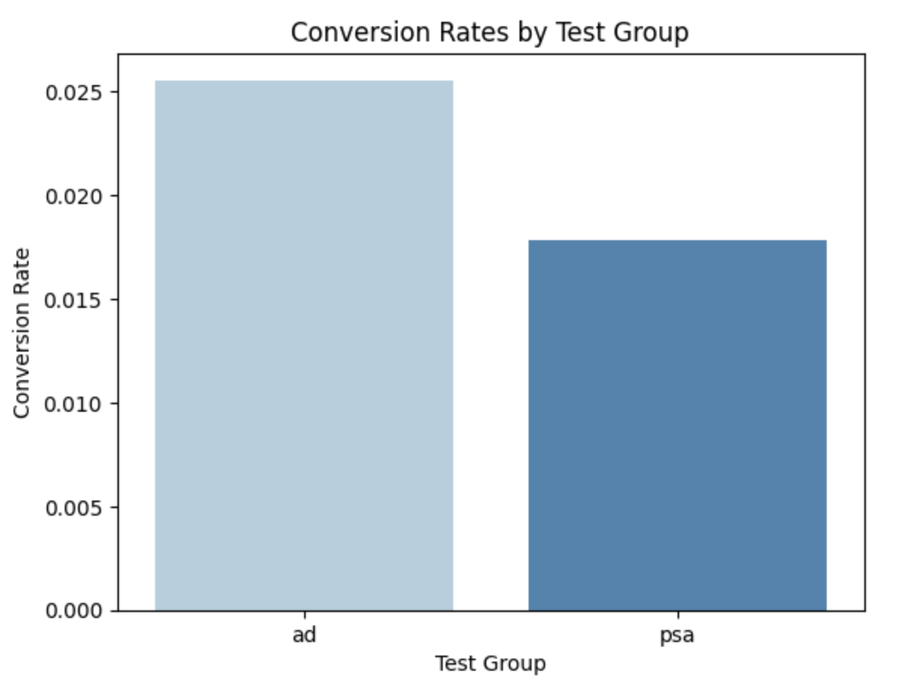

# 📊 A/B Testing Analysis: Marketing Campaign Effectiveness

## 📌 Overview
This project evaluates the effectiveness of an online **marketing campaign** through **A/B testing**. We compare two test groups to determine whether advertising influences conversion rates.

- **Ad Group**: Users who were shown an advertisement.  
- **PSA Group**: Users who were shown a public service announcement.  

By analyzing user behavior and applying statistical methods, we aim to determine whether the advertisement significantly increases conversions.

---

## 🗂 Dataset
- **Filename:** `marketing_AB.csv`
- **Source:** [Kaggle](https://www.kaggle.com/)  
- **Key Features:**
  - `user_id` → Unique identifier for each user.
  - `test_group` → Specifies whether the user was in the **Ad** or **PSA** group.
  - `converted` → Indicates whether the user converted (1) or not (0).
  - `total_ads` → Number of ads shown to the user.
  - `most_ads_day` → The day on which the user saw the most ads.
  - `most_ads_hour` → The hour during which the user saw the most ads.

---

## 📉 Key Findings
- **Conversion Rates:**
  - **Ad Group**: **2.55%**  
  - **PSA Group**: **1.79%**  
- **A/B Test Results (Chi-Square Test)**:
  - **Test Statistic**: **54.01**
  - **P-Value**: **< 0.0001**
  - **Conclusion**: The advertisement **significantly increases** conversion rates. ✅  

---

## 📊 Visualization  
Below is a visualization of the conversion rate comparison:  



---

## 🛠️ How to Run the Analysis
Follow these steps to reproduce the analysis on your local machine.

### 1️⃣ Clone the Repository
```bash
git clone https://github.com/andrewsatyo9/ab_testing_project.git
cd ab_testing_project
```

## 🚀 Future Improvements
- Perform multi-variant testing for different ad formats.
- Analyze time-based trends in user behavior.
- Extend analysis with funnel conversion tracking.

---

*Author: Andrew Jaya Satyo*  
*LinkedIn: linkedin.com/in/andrew-jaya-satyo-1501992b4*  
*Email: andrewjaya12345@gmail.com*  
